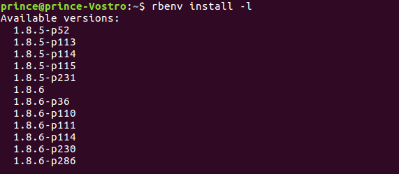
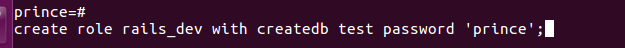
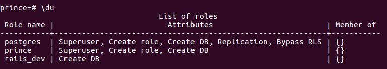

## Installation process for Ruby on Rails with PostgreSQL on Ubuntu 16.04 in local
#### Prerequisites
We are using `rbenv` for installation of Ruby on Rails.
1. update the local package cache  
  `$ sudo apt-get update `

2. Install dependencies required for rbenv and Ruby  
  `$ sudo apt-get install autoconf bison build-essential libssl-dev libyaml-dev libreadline6-dev zlib1g-dev libncurses5-dev libffi-dev libgdbm3 libgdbm-dev `

#### Install rbenv
1. Clone the rbenv repository from git in home directory.  
`git clone https://github.com/rbenv/rbenv.git ~/.rbenv`

2. For command line utility we have to add bin in `$PATH`  
  `$ echo 'export PATH="$HOME/.rbenv/bin:$PATH"' >> ~/.bashrc`  
  `$ echo 'eval "$(rbenv init -)"' >> ~/.bashrc `

  For cross check we check in `~/.bashrc` file   
  
  
  
3. Update source file  
  `$ source ~/.bashrc`  
After update source file we can use rbenv utility
4. for confirmation of rbenv setup
  `$ type rbenv`  
  output:-
  

#### Install Ruby
1. First check avilable version of Ruby   
 `rbenv install -l `   
 output:-  
 
2.  We'll now install a particular version of Ruby. like install Ruby version 2.3.1, and once it's done installing, we can set it as our default version with the global sub-command: 

`$ rbenv install 2.3.1`   
`$ rbenv global 2.3.1`

3. Verify that Ruby was properly installed by checking your version number:

`ruby -v`   

output:-  

#### Install Nodejs
1. Rails requires a JavaScript runtime to compile the Rails asset pipeline. For Rails development on Ubuntu Linux, it's best to install Nodejs as the Javascript runtime.   
`$ sudo apt-get update`   
`$ sudo apt-get install nodejs
`
2. check Nodejs install or not   
 

#### Configure Ruby Gem
1. RubyGems is a Ruby Package Manager. It's coming with the gem command-line tool and is automatically installed when we install Ruby on the system.
Update the gem version and check it:   
` $ gem update --system`  
` $ gem -v`   
output:-

2. This is optional, you can disable to install the documentation on every gem installation by adding a new line to the `.gemrc` file below.  
`$ echo "gem: --no-document" >> ~/.gemrc`

#### Install Rails
1. Install the most recent version of Rails with the gem install command:  
`$ gem install rails`   
 if you want to particular version use below command  
 `gem install rails -v 4.2.7`   
 Here 4.2.7 is version of rails       
2. Check rail version installed   
  `rails -v`  
  

#### Setting up the PostgreSQL Database for Rails Development
1. Install PostgreSQL and some other required packages with the apt command:   
`$ suod apt-get -y install postgresql postgresql-contrib libpq-dev `
2. The installation procedure created a user account called postgres that is associated with the default Postgres role. In order to use Postgres, we'll need to log into that account. You can do that by typing:  
`$ sudo -i -u postgres`    
We can get a Postgres prompt immediately by typing:
`psql`  
Exit out of the PostgreSQL prompt by typing:
`\q`

3. Go to PSQL prompt, create a new role named 'rails-dev' for the rails development with the command below:   
 `create role rails_dev with createdb login password 'prince';`

4. Now check the new role and you will see new role has been created:  
`\du `

5. (Optional) Connect to Postgres with the login User so you can directly run `psql`   
`$ sudo -i -u prince`

#### Create the First Application with Rails and PostgreSQL
1. Create a new application "myapp" with PostgreSQL as the default database  

2. Go to myapp and configer database   
`cd myapp/`    
`vim config/database.yml`     
After that, uncomment the hileghted line also change the default value

3. Generate the database with the rails command:   
`rails db:setup`  
`rails db:migrate
`

4. Start Rail Server in app directory  
`$ rail s`

5. Open in browser with `0.0.0.0:3000` or `127.0.0.1:3000` or `localhost:3000`

Optional:- If we want to bind IP address and port we start server with bind value:   
`rails s -b 192.168.16.12 -p 8080`   
8080:- port
192.168.16.12:- IP
